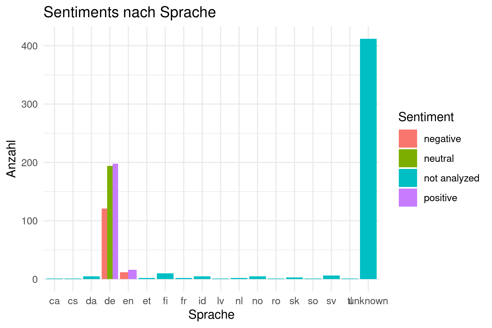

---
title: "Studentenfeedback-Bericht"
output: pdf_document
---

In diesem Bericht wird das Feedback der Studierenden zu verschiedenen Aspekten des Lehrangebots ausgewertet, um Verbesserungsansätze zu identifizieren. Die allgemeine Zufriedenheit ist überwiegend hoch; dennoch gibt es Bereiche, in denen sich die Studierenden Weiterentwicklungen wünschen.

## Zufriedenheit mit Vorlesungen und Übungen

Die Mehrheit der Studierenden bewertet die Vorlesungen positiv, besonders hinsichtlich Struktur und Inhalt. Einige wünschen sich jedoch mehr Interaktivität zur besseren Festigung der Inhalte. Auch die Übungsgruppen erhalten gutes Feedback, allerdings äußerten manche den Wunsch nach kleineren Gruppen und einer besseren Betreuung.

## Unterstützung durch Lehrende

Die Unterstützung und Zugänglichkeit der Lehrenden werden generell als sehr gut wahrgenommen. Studierende schätzen die schnelle Reaktion auf Anfragen. Ein kleines Verbesserungspotenzial liegt in der Erweiterung der digitalen Betreuungsmöglichkeiten.

## Zufriedenheit mit Lernmaterialien

Das zur Verfügung gestellte Lernmaterial wird überwiegend positiv bewertet. Einige Studierende wünschen sich jedoch mehr ergänzende digitale Ressourcen und aktuelle Inhalte.

## Fazit

Das Feedback zeigt eine hohe Zufriedenheit, weist jedoch auf Potenziale in Interaktivität, Betreuung und digitalen Ressourcen hin.

